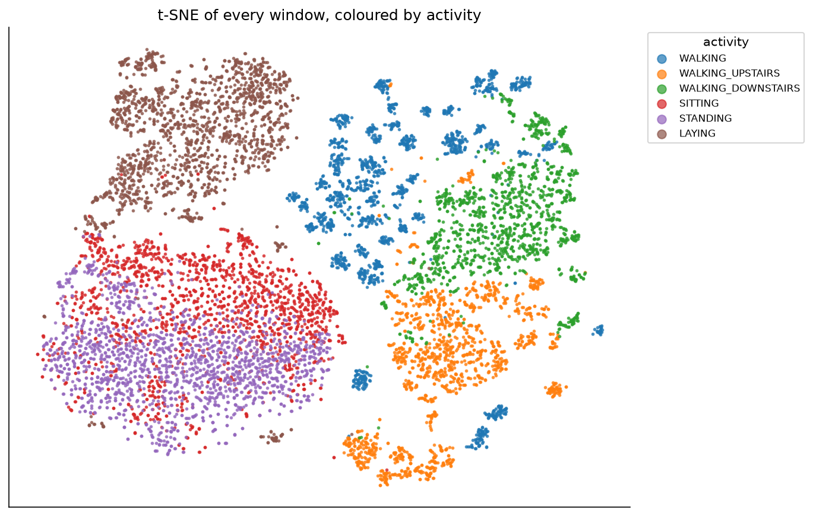
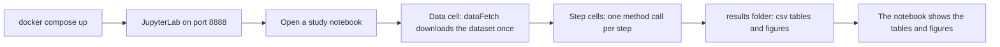
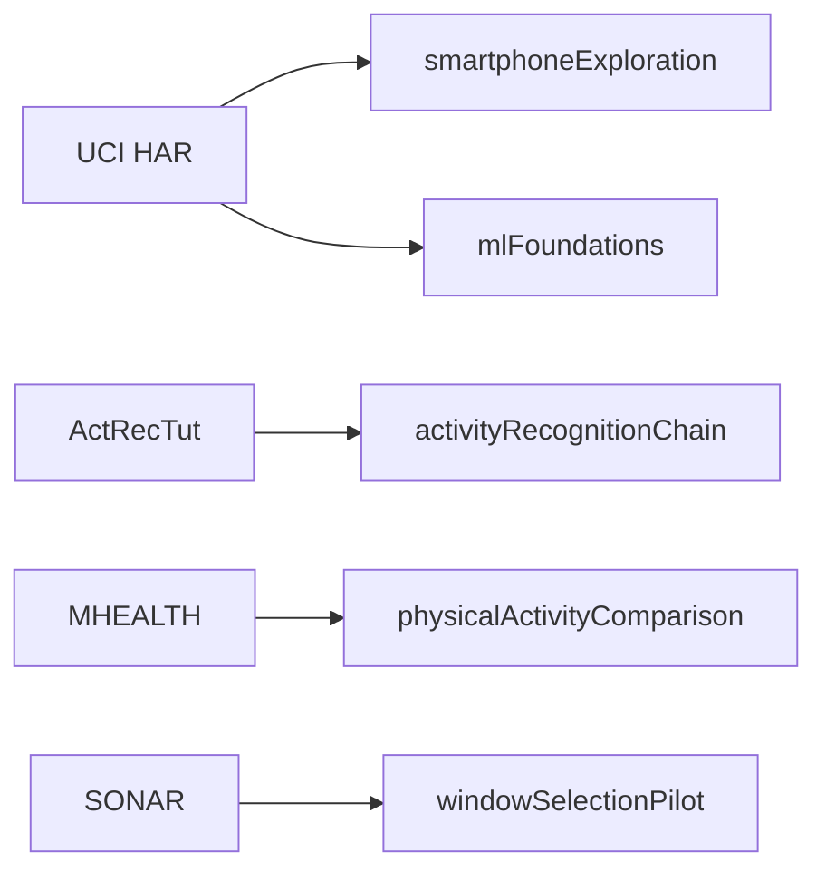
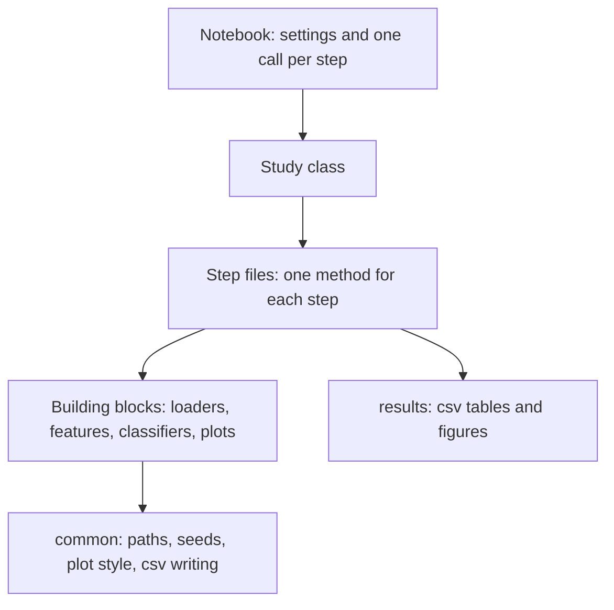
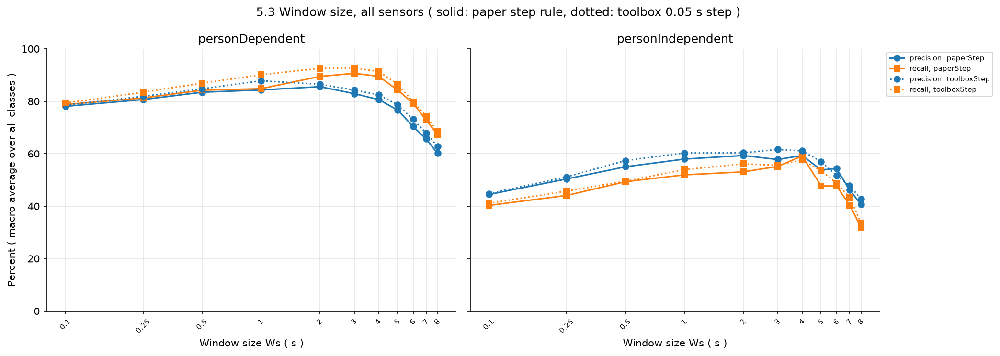
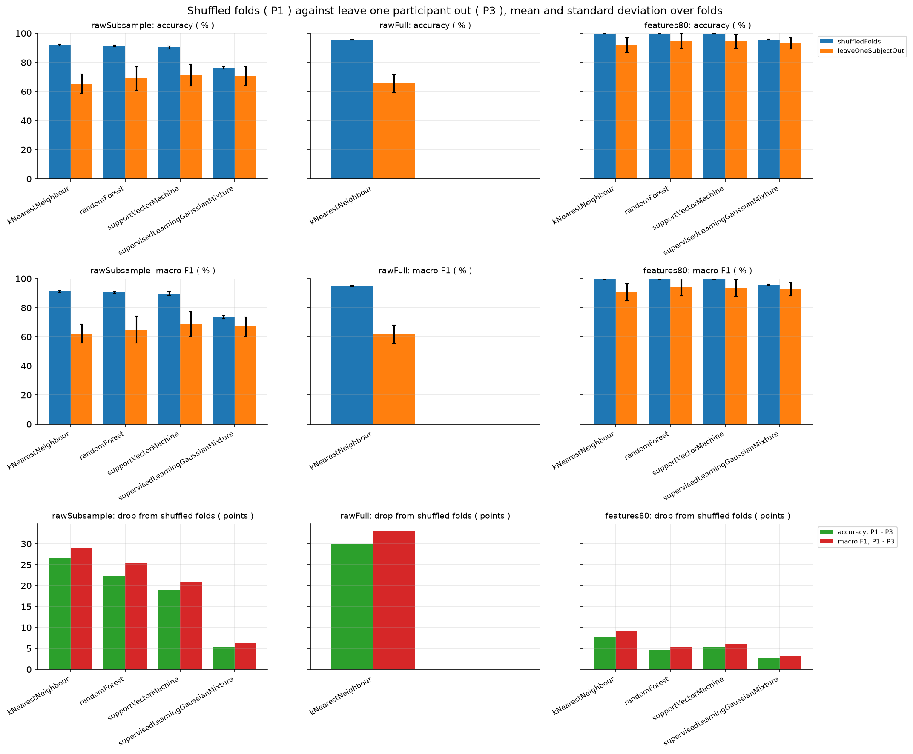

# Human activity recognition studies

Five small studies on telling what people are doing from motion sensors. Each study is a Jupyter notebook with a few small helper files. You can run it, read it and change it.

<p align="center">
  
</p>

## Quick start

1. Install Docker with Compose.
2. Get the code and start the lab:

   ```bash
   git clone https://github.com/codeadeel/harstudies
   cd harstudies
   docker compose up
   ```

3. Open http://localhost:8888 in your browser. JupyterLab starts without a password.
4. Open a study folder, read its `README.md`, then open the notebook and choose Run, Run All Cells.

The first start builds the image, which takes a few minutes. Each notebook downloads the data it needs the first time you run it. To stop the lab, press Ctrl+C or run `docker compose down` in another terminal.

## How a run works



## The studies

| Folder | What you do there | Data | Run time |
|---|---|---|---|
| [`smartphoneExploration`](smartphoneExploration) | Rebuild a public Kaggle notebook: map the windows with t-SNE, classify activities, identify people, estimate walking speed | UCI HAR | about 11 minutes |
| [`activityRecognitionChain`](activityRecognitionChain) | Rebuild the case study of a tutorial paper on activity recognition and compare it with the values the paper prints | ActRecTut | about 20 minutes |
| [`physicalActivityComparison`](physicalActivityComparison) | Repeat the evaluation of a paper and compare shuffled folds with leave one participant out | MHEALTH | about 15 minutes |
| [`mlFoundations`](mlFoundations) | Work through the chapters of the tutorialspoint tutorial "Machine Learning with Python" | UCI HAR | about 10 minutes |
| [`windowSelectionPilot`](windowSelectionPilot) | A small experiment on choosing windows before the recognizer | SONAR | about 5 minutes, plus the data download |

The run times are for one notebook on an 8 core computer. A slower computer takes longer.

## The data

Every dataset comes from people who wore motion sensors while they did activities. A row is one moment or one window, and a column is one sensor channel. A shape such as `(rows, columns)` says how many rows there are and how many numbers describe each one.



| Dataset | People | Labels | Worn sensors | Rate | Shape |
|---|---|---|---|---|---|
| UCI HAR | 30 | 6 activities | smartphone on the waist | 50 Hz | `(7352, 561)` train and `(2947, 561)` test. One row is one window of 128 readings. |
| MHEALTH | 10 | 12 activities, plus label 0 for no activity | chest, left ankle, right lower arm | 50 Hz | `(rows, 24)` for each person: 23 signal columns and the label |
| ActRecTut | 2 | 11 gestures, plus NULL for no gesture | three motion sensors on one arm | 32 Hz | `(62480, 15)` and `(70778, 15)` |
| SONAR | 14 | 22 activities, plus a null label | five body sensors | 60 Hz | `(samples, 30)` for each of the 254 recordings |

## Inside a study



- `README.md` explains the study in a few lines.
- `<study>.ipynb` is the main study file. It runs the steps one after another, with a short explanation before each step.
- The `.py` files are small helpers, each with one job. The notebook calls them.
- Each step writes csv tables and figures to `results/<study>/`.

## Results

The `results/` folder holds the output of one full run, so you can read it without running anything. A few examples:

<p align="center">
  
</p>

<p align="center">
  
</p>

<p align="center">
  
</p>

## Change things

The repository folder is shared with the container. When you edit a notebook or a `.py` file in JupyterLab, the change is saved in this folder on your computer. Settings such as the random seed and the number of workers are in the first code cell of each notebook.

Running a notebook writes its tables and figures to `results/<study>/` again, so the files in that folder change.

The random seed is fixed, so a run repeats exactly on the same computer. On a computer with a different number of cores, a few values can differ slightly, because some math libraries split the work differently.

## Use a remote computer

If Docker runs on another computer, forward the port first:

```bash
ssh -L 8888:localhost:8888 you@remote-computer
```

Then open http://localhost:8888 on your own computer. The lab listens on the local address only and has no password, so do not open the port to a network.

## Requirements

- Docker with Compose. Nothing else is installed on your computer.
- About 8 GB of free disk space for `data/` when you run all studies. The SONAR download is 6.0 GB and its converted files take 1.7 GB. The other datasets are small.
- No GPU is needed.

## Datasets

The datasets are not stored in the repository. The notebooks download them into `data/`, which git ignores.

| Dataset | Source | Licence |
|---|---|---|
| UCI HAR, Human Activity Recognition Using Smartphones | https://archive.ics.uci.edu/dataset/240/human+activity+recognition+using+smartphones | CC BY 4.0, as stated on the dataset page |
| MHEALTH | https://archive.ics.uci.edu/dataset/319/mhealth+dataset | CC BY 4.0, as stated on the dataset page |
| ActRecTut | https://github.com/andreas-bulling/ActRecTut | GPL-3.0 for the repository (its `LICENSE` file). It states no separate licence for the `Data` folder. |
| SONAR, machine learning version | https://zenodo.org/records/7881952 | CC-BY-4.0, as stated in the Zenodo record |

Only the `Data` folder of ActRecTut is used. None of the code in that repository is used or copied.

The SONAR machine learning version has no raw acceleration or gyroscope columns. It stores the change of velocity and orientation for every sample. The download step converts these back to acceleration and angular rate, one recording at a time, and saves them as float32.

## Folder layout

```
docker-compose.yml            one service, JupyterLab on port 8888
Dockerfile                    the image: Python 3.12 and the pinned packages
requirements.txt              exact package versions
common/                       small helpers: paths, seeds, plot style, csv writing
dataFetch/                    downloads the datasets and converts SONAR
smartphoneExploration/        study folder: README, notebook, helper files
activityRecognitionChain/     study folder
physicalActivityComparison/   study folder
mlFoundations/                study folder
windowSelectionPilot/         study folder
results/                      csv tables and figures for every study
data/                         downloaded datasets, created on the first run, not in git
```

## Licence

The code in this repository is released under the MIT licence. See `LICENSE`. The datasets keep their own licences, listed above.
