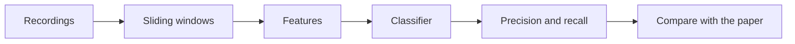
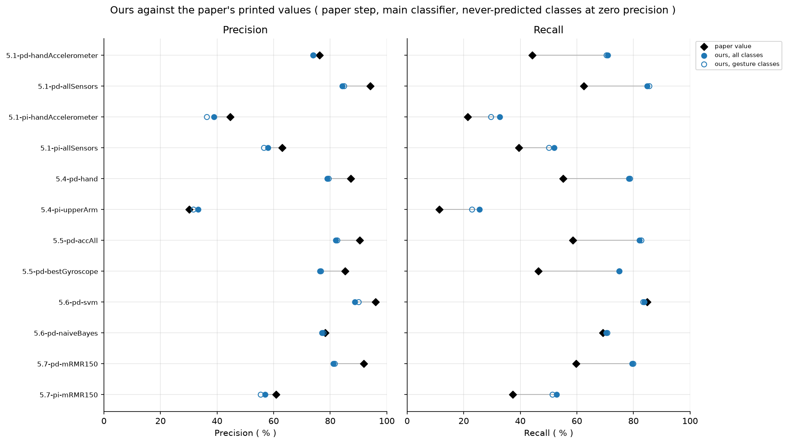

# Activity recognition chain

This study rebuilds the case study of a tutorial paper on activity recognition with body worn motion sensors. It runs the recognition chain on gesture recordings and compares the scores with the values the paper prints.

## The data

ActRecTut: gesture recordings of two people who wore three motion sensors on one arm. It comes from https://github.com/andreas-bulling/ActRecTut. The notebook downloads it on the first run and reuses the files after that. Only the `Data` folder is used.

- The sensors sit on the hand, the lower arm and the upper arm. Each one gives three acceleration axes and two gyroscope axes, so a recording has 15 channels at 32 Hz.
- Each person has one data matrix: `(62480, 15)` and `(70778, 15)`. Every row has a label.
- There are 11 gestures, such as open window, drink, stir, forehand and smash. Label 1 is NULL, which means no gesture.

## How the study runs

The notebook follows the sections of the paper. Each section changes one part of the chain and keeps the rest fixed.

| Notebook step | What changes |
|---|---|
| Section 5.1, basic chain | The plain chain with a simple classifier |
| Section 5.2, feature types | Raw, VerySimple, Simple, FFT and All |
| Section 5.3, window size | Windows from 0.1 to 8 seconds |
| Section 5.4, sensor placement | Hand, lower arm, upper arm and their combinations |
| Section 5.5, sensor type | Accelerometer or gyroscope, for each placement and combined |
| Section 5.6, classifiers | Linear discriminant, naive Bayes, SVM, hidden Markov model, AdaBoost and k-NN |
| Section 5.7, feature selection | mRMR with different numbers of kept features |

Every configuration runs person dependent and person independent, and is scored frame by frame and event by event. After the sections, the notebook runs a few extra checks and sets our values next to the ones the paper prints.

## How to run

1. From the repository folder run `docker compose up`.
2. Open http://localhost:8888 in a browser and open the folder `activityRecognitionChain`.
3. Open `activityRecognitionChain.ipynb` and run all cells. It takes about 20 minutes on an 8 core computer. A slower computer takes longer.

## Example results

All figures are in `results/activityRecognitionChain/figures/`.

  

  

## Files

| File | What it does |
|---|---|
| `activityRecognitionChain.ipynb` | The main study. Run it from top to bottom. |
| `barAndSweepPlots.py` | Bar charts, sweep curves and the comparison plot. |
| `basicChainSections.py` | Sections 5.1 to 5.3: basic chain, feature types, window sizes. |
| `basicConfusions.py` | Confusion matrices of the basic chain. |
| `bestChoiceChecks.py` | Checks that the best classifier and feature count hold. |
| `chainClassifiers.py` | Builds the classifiers and fits the SVM with its grid search. |
| `chainEvaluation.py` | Runs one configuration under both evaluation schemes. |
| `chainStudy.py` | The study class. It joins all steps and holds the settings. |
| `comparisonRows.py` | Measures one printed value against ours. |
| `configurationRunner.py` | Runs a configuration and averages its rounds. |
| `dataDescription.py` | Describes the segments of both recordings. |
| `eventAndNullLoss.py` | Extra checks: event scores and loss to NULL. |
| `featureExtractor.py` | Computes the five feature types. |
| `filledFrames.py` | Finds filled frames and tests their replacement. |
| `gestureLoader.py` | Loads the recordings, channels, classes and repetition blocks. |
| `leftRightHmmClassifier.py` | Left-right hidden Markov model classifier. |
| `mrmrSelector.py` | Ranks features with mRMR. |
| `paperComparison.py` | Pairs printed paper values with our values. |
| `paperReference.py` | Writes the values and statements the paper prints. |
| `qualitativeChecks.py` | Tests statements on window size, features and raw frames. |
| `recordingAccess.py` | Prepares recordings and caches windows and features. |
| `roundPrediction.py` | Trains the classifier of one round and predicts. |
| `roundScoring.py` | Scores one round by frame and by event. |
| `roundSplitting.py` | Lists the rounds and splits them into train and test. |
| `runControl.py` | Starts a run and finishes it with the round metrics. |
| `runParameters.py` | Writes the recorded settings to runParameters.csv. |
| `sectionFigures.py` | Draws one figure per section. |
| `sensorAndClassifierSections.py` | Sections 5.4 to 5.7: placement, sensor type, classifiers, selection. |
| `settingRows.py` | Lists the feature and classifier settings. |
| `slidingWindows.py` | Cuts a recording into windows and labels them. |
| `zeroLineSensitivity.py` | Extra check: zero line of the crossing rate. |

## What you get

The notebook writes to `results/activityRecognitionChain/`:

- csv tables, one or more for every step
- `figures/` with the png figures of the sections, the extra checks and the comparison
