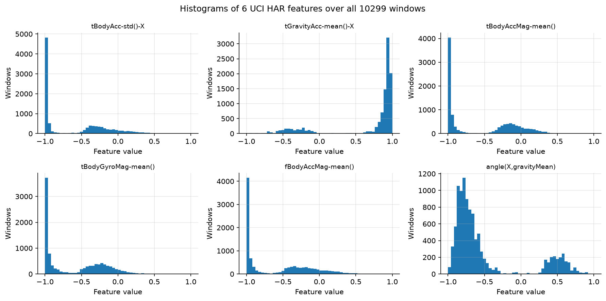
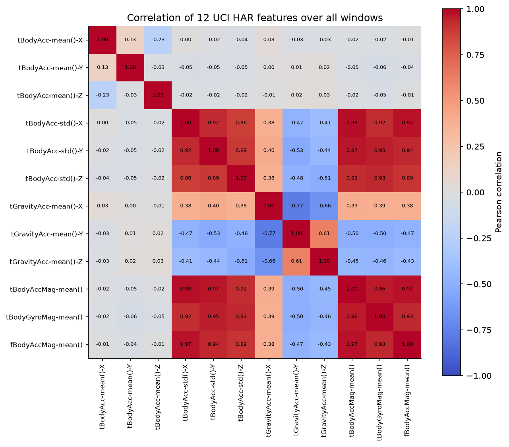
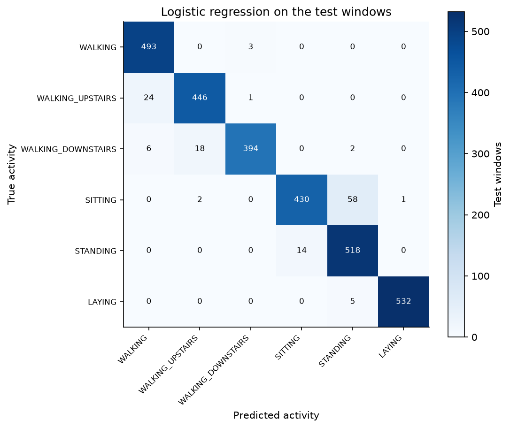

# Machine learning foundations

## What this study is

This study works through the chapters of the tutorialspoint tutorial "Machine Learning with Python". It runs them on smartphone activity data and writes tables and figures.

## The data

- UCI HAR (Human Activity Recognition Using Smartphones) from the UCI Machine Learning Repository: https://archive.ics.uci.edu/static/public/240/human+activity+recognition+using+smartphones.zip
- The notebook downloads it on the first run. Later runs reuse the files.
- 30 people wore a smartphone on the waist and did six activities. Every row is one window of the recording with 561 features: `(7352, 561)` for training and `(2947, 561)` for testing.
- The regression chapter uses the small diabetes data that comes with scikit-learn. It needs no download.

## How the study runs

Each chapter of the tutorial is one step in the notebook.

## How to run

1. From the repository folder run `docker compose up`.
2. Open http://localhost:8888 in a browser and open the folder `mlFoundations`.
3. Open `mlFoundations.ipynb` and run all cells. It takes about 10 minutes on an 8 core computer. A slower computer takes longer.

## Example results

All figures are in `results/mlFoundations/figures/`.

  

  

  

## Files in this folder

| File | What it does |
|---|---|
| `mlFoundations.ipynb` | The main study file. It runs every chapter in order and shows the tables and figures. |
| `foundationsStudy.py` | The study class. It sets up the run and holds the settings. |
| `modelHelpers.py` | Creates the logistic regression and fits and scores one classifier. |
| `parameterSections.py` | Records the settings and writes `runParameters.csv`. |
| `loadingSections.py` | Loads the UCI HAR windows and splits them into training and test. |
| `statisticsSections.py` | Writes the class counts, the statistics and the correlation counts. |
| `statisticsPlots.py` | Draws the histograms, the box plot and the correlation heatmap. |
| `preparationSections.py` | Applies the scaling, normalization, binarization, standardization and label encoding. |
| `selectionSections.py` | Selects features with SelectKBest, RFE, PCA and tree importance and scores each subset. |
| `classifierSections.py` | Fits the classifiers and scores them on the test windows. |
| `regressionSections.py` | Fits two regressors on the diabetes data. |
| `clusteringSections.py` | Groups a sample of the windows with k-means, mean shift and hierarchical clustering. |
| `metricsSections.py` | Writes the confusion matrix, the report per activity and the probability scores. |
| `workflowSections.py` | Builds a Pipeline and a FeatureUnion and scores them. |
| `improvementSections.py` | Compares the ensembles and tunes the support vector machine. |

## What you get

The files land in `results/mlFoundations/`: csv tables (one or more per chapter) and figures in `figures/`.
