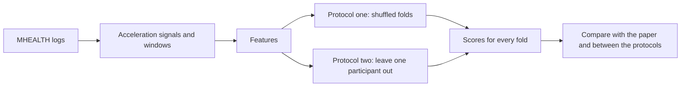
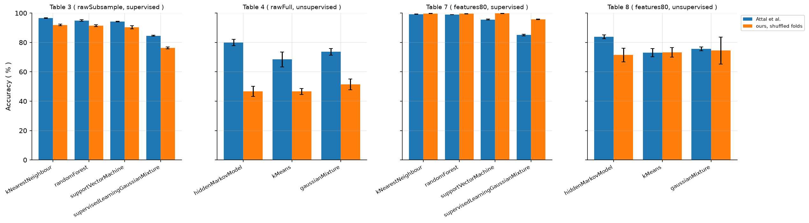
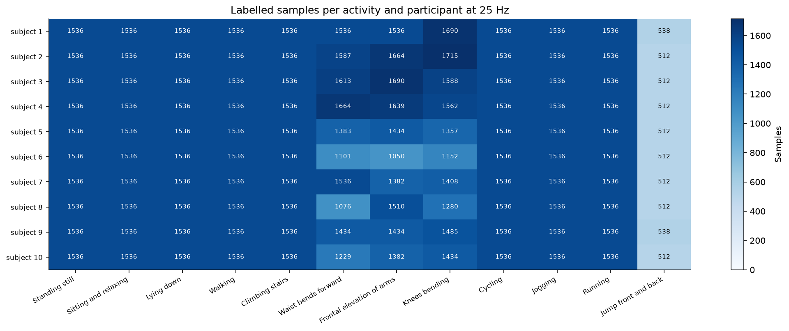

# Physical activity comparison

This study repeats the method of Attal et al. on the MHEALTH dataset. It tests the same classifiers with shuffled folds, as in the paper, and with leave one participant out, so you can see how much the way of testing changes the score.

## The data

MHEALTH is a public set of body worn sensor recordings of volunteers doing daily activities and exercises. It comes from the UCI Machine Learning Repository: https://archive.ics.uci.edu/static/public/319/mhealth+dataset.zip

The notebook downloads it on the first run and keeps it in the `data` folder. Later runs reuse it.

- 10 people did 12 activities, such as walking, climbing stairs, cycling, jogging and jumping. Label 0 marks the samples with no activity.
- Sensors on the chest, the left ankle and the right lower arm recorded at 50 Hz.
- Each person has one log file with `(rows, 24)` numbers: 23 signal columns and the label.
- The study keeps the nine acceleration signals, three axes for each of the three sensors. It filters them and keeps every second sample, so the study works at 25 Hz.

## How the study runs

- The study runs four supervised classifiers: k-NN, random forest, SVM and a Gaussian mixture. It also runs three unsupervised models: a hidden Markov model, k-means and a Gaussian mixture. Their clusters are matched to activities afterwards.
- It tests three data variants: all raw samples, a small random share of the raw samples, and window features.
- Shuffled folds put rows of the same person into both the training set and the test set. Leave one participant out tests on a person the classifier has never seen.
- A random forest ranks the features inside every training fold, so no test data can influence the choice.

## How to run

1. From the repository folder run `docker compose up`.
2. Open http://localhost:8888 in a browser and open the `physicalActivityComparison` folder.
3. Open `physicalActivityComparison.ipynb` and run all cells. It takes about 15 minutes on an 8 core computer. A slower computer takes longer.

## Example results

All figures are in `results/physicalActivityComparison/figures/`.

  

The drop is larger for the raw data than for the window features.

  

  

## Files in this folder

| File | What it does |
|---|---|
| `physicalActivityComparison.ipynb` | The main notebook. It runs every step and shows the tables and figures. |
| `comparisonStudy.py` | The study class. It holds the settings and calls every step in order. |
| `dataPreparationSteps.py` | Loads the recordings, computes the features and ranks them once. |
| `inventorySteps.py` | Counts samples per participant and activity and draws the count figure. |
| `foldEvaluationSteps.py` | Lists the fold jobs and runs them on worker processes. |
| `foldScoringSteps.py` | Scores every fold and adds up the confusion counts. |
| `metricSummarySteps.py` | Puts the fold scores in a fixed order and averages them. |
| `paperComparisonSteps.py` | Writes the paper's values and sets our scores next to them. |
| `protocolComparisonSteps.py` | Compares shuffled folds with leave one participant out. |
| `confusionSteps.py` | Writes and draws the confusion matrices. |
| `parameterSteps.py` | Writes `runParameters.csv` with the run, data and feature settings. |
| `methodParameterSteps.py` | Lists the classifier and protocol rows of that table. |
| `mhealthLoader.py` | Reads the recordings and cuts them into activity segments. |
| `attalFeatures.py` | Cuts windows and computes the features of every window. |
| `protocolFolds.py` | Builds the folds of both protocols. |
| `foldWorkers.py` | The work done on one fold inside a worker process. |
| `attalClassifiers.py` | The classifier settings and the forest feature ranking. |
| `classifierTuning.py` | Picks the neighbour count, tree count and SVM setting. |
| `supervisedFitting.py` | Tunes and fits the four supervised classifiers. |
| `unsupervisedFitting.py` | Fits the unsupervised models and matches clusters to labels. |
| `flooredGmmHmm.py` | A hidden Markov model whose variances stay above a floor. |

## What you get

Everything lands in `results/physicalActivityComparison/`:

- csv tables for the data counts, the feature ranking, the fold scores, the averages, the paper values, the comparison, the protocol comparison and the confusions
- four figures in `figures/`
