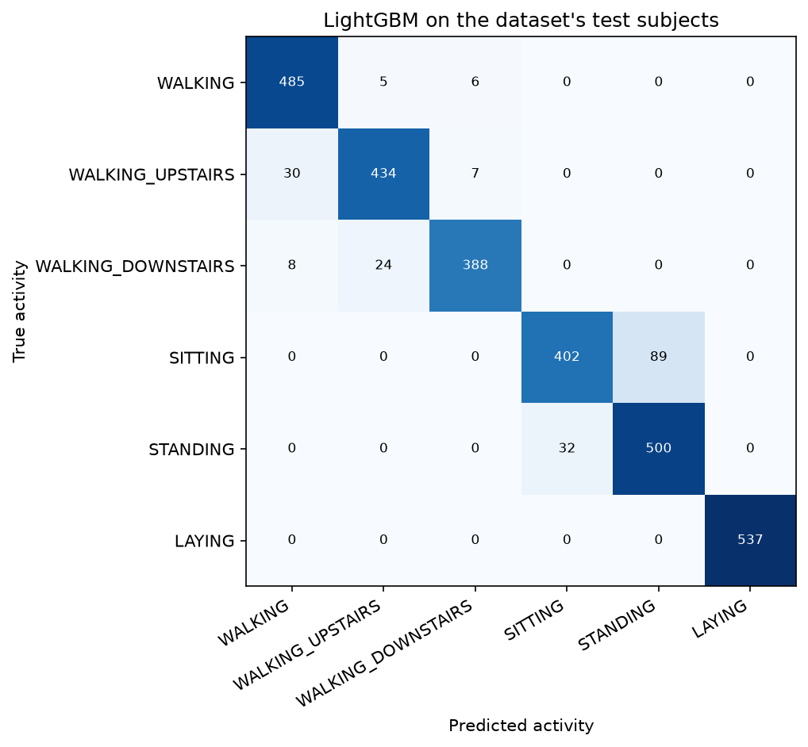
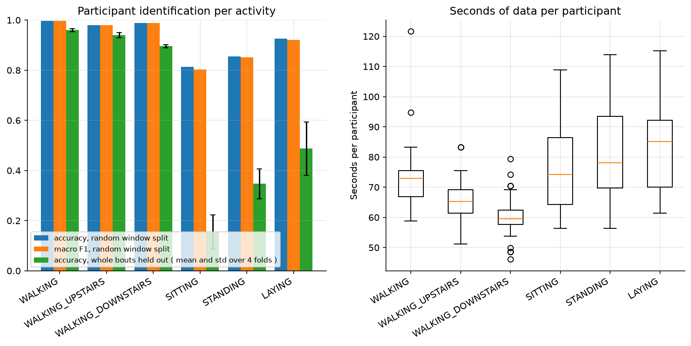
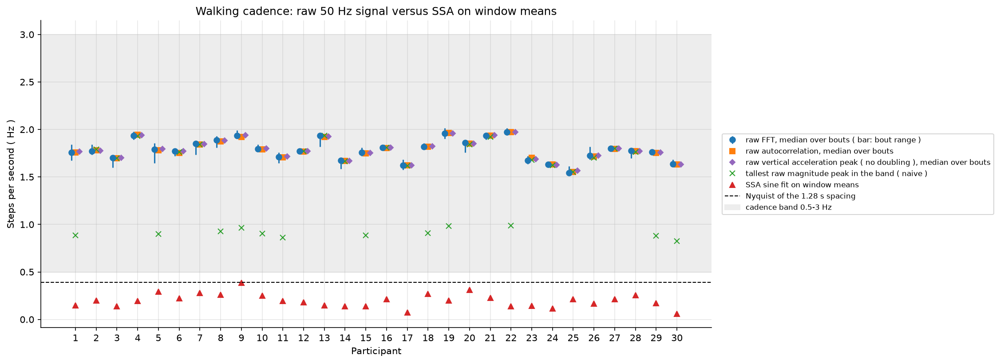

# Smartphone data exploration

This study rebuilds a public Kaggle notebook, "What Does Your Smartphone Know About You?", on the UCI HAR smartphone data. It looks at the features, maps all windows with t-SNE, trains a LightGBM classifier, identifies people from their movement and estimates how fast they walk.

## The data

UCI HAR, "Human Activity Recognition Using Smartphones", from the UCI Machine Learning Repository. The notebook downloads it from https://archive.ics.uci.edu/static/public/240/human+activity+recognition+using+smartphones.zip on the first run. After that it uses the copy in the `data` folder.

- 30 people wore a smartphone on the waist and did six activities: walking, walking upstairs, walking downstairs, sitting, standing and laying.
- The phone recorded acceleration and rotation at 50 Hz. The recordings are cut into windows of 128 readings that overlap by half.
- `X` holds 561 features for each window: `(7352, 561)` for training and `(2947, 561)` for testing. The training windows come from 21 people and the test windows from the other 9.
- The raw signals come in 9 files for each split, one per channel. Each file has one row per window and 128 readings per row.

## How the study runs

```mermaid
flowchart LR
    A["Load windows and raw signals"] --> B["Feature groups and activity counts"]
    B --> C["PCA and t-SNE map"]
    C --> D["LightGBM activity classifier"]
    D --> E["Identify participants"]
    E --> F["Accelerometer or gyroscope"]
    F --> G["Stair durations"]
    G --> H["Walking frequency with SSA"]
    H --> I["Walking cadence from the raw signal"]
```

Windows overlap by half, so two neighbouring windows share half of their readings. The loader finds chains of such windows and calls each chain a bout. A bout is one continuous recording. The identification step uses bouts to hold out whole recordings, because a random split would put near copies of a window on both sides.

## How to run

1. From the repository folder run `docker compose up`.
2. Open http://localhost:8888 in a browser and open the `smartphoneExploration` folder.
3. Open `smartphoneExploration.ipynb` and run all cells. It takes about 11 minutes on an 8 core computer. A slower computer takes longer.

## Example results

All figures are in `results/smartphoneExploration/figures/`.

  

  

With a random window split the scores are higher than with whole bouts held out, most clearly for sitting, standing and laying.

  

## The files in this folder

| File | What it does |
|---|---|
| `smartphoneExploration.ipynb` | The main study file. Run it from top to bottom. |
| `smartphoneExplorer.py` | The study class. It joins the section files. |
| `runSetup.py` | Seeds, recorded run parameters, the shared classifier and `runParameters.csv`. |
| `loadingSections.py` | Loads the windows, the raw signals and the recording bouts. |
| `explorationSections.py` | Counts the feature groups and the activity labels. |
| `embeddingSections.py` | PCA and t-SNE map of all windows. |
| `classificationSections.py` | LightGBM activity classifier and its tables. |
| `participantSections.py` | Identifies people within each activity. |
| `participantScoring.py` | Scores identification with a random split and with whole bouts held out. |
| `participantPlots.py` | Figures for the identification step. |
| `sensorSections.py` | Accelerometer against gyroscope importance for walking. |
| `staircaseSections.py` | Upstairs and downstairs durations. |
| `ssaSections.py` | Walking frequency from the window means with SSA. |
| `ssaPlots.py` | Figure for the SSA step. |
| `singularSpectrumAnalysis.py` | The SSA class. |
| `ssaDecomposition.py` | Splits a series into components and measures how well two components separate. |
| `ssaSineFit.py` | Fits a sine wave to a series. |
| `cadenceSections.py` | Walking cadence from the raw signals. |
| `cadenceBoutEstimates.py` | Cadence of single walking bouts and per person. |
| `cadencePlots.py` | Figures for the cadence step. |
| `rawCadenceEstimator.py` | The cadence estimator class. |
| `cadenceSignals.py` | Rebuilds bout signals, magnitude and vertical acceleration. |
| `cadenceEstimates.py` | Spectrum, peak and autocorrelation cadence estimates. |
| `harLoader.py` | Reads the UCI HAR files in one aligned row order. |
| `harBouts.py` | Finds the continuous recording bouts. |

## What you get

The notebook writes to `results/smartphoneExploration/`:

- csv tables, one or more for each step
- png figures in `figures/`
