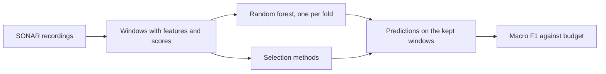
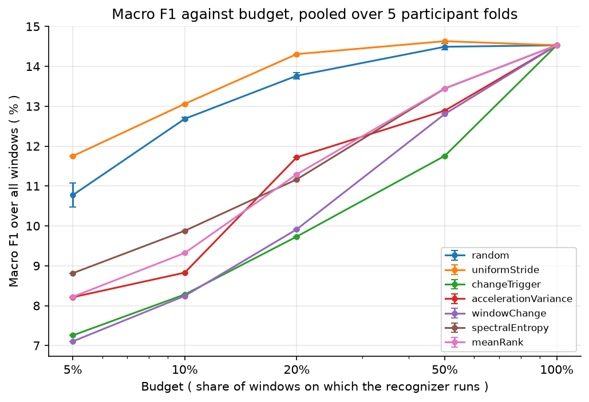
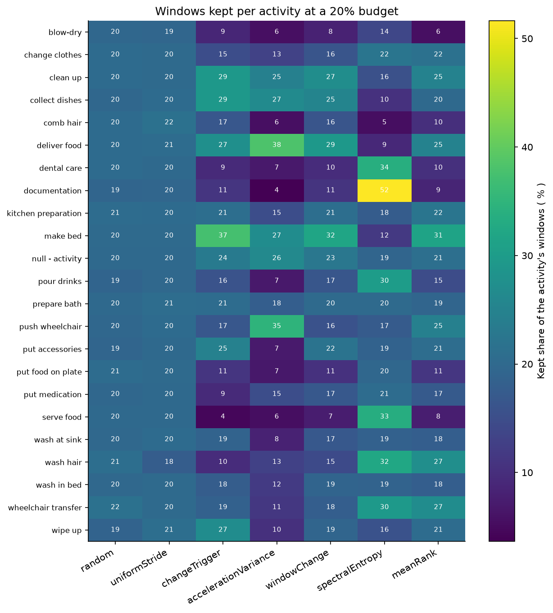

# Window selection pilot

This study is a small experiment on choosing windows before the recognizer. A recognizer runs on only some of the windows, and a cheap score decides which ones. You see how much accuracy is kept at each budget.

## The data

- SONAR nursing activity recordings, machine learning version, from body sensors.
- Source: https://zenodo.org/api/records/7881952/files/SONAR_ML.zip/content
- It downloads on the first run into the `data` folder and is converted once. The file is large, so the first run takes longer. After that the notebook only reads the converted files.
- 14 people are in 254 recordings, with five body sensors at 60 Hz.
- Each recording is converted to a float32 array of shape `(samples, 30)`. The 30 channels are acceleration and angular rate, three axes each, for the five sensors.
- Every sample has one of 23 labels. One of them is a null label, `null - activity`.

## How the study runs

- The recordings are cut into windows of 2 seconds. Each window gets features for every channel: the mean, the variance, six band powers and the dominant frequency.
- A random forest of 100 trees is trained once for each of 5 folds. The folds keep all recordings of a person together.
- The budget is the share of windows on which the recognizer may run: 5, 10, 20, 50 and 100 percent. A window that is skipped keeps the prediction of the last window that ran.
- The selection methods are:
  - `random` and `uniformStride`: random windows, and evenly spaced windows
  - `changeTrigger`: the windows whose change from the previous window reaches a threshold
  - `accelerationVariance`, `windowChange` and `spectralEntropy`: the windows with the highest score. None of these scores needs training.
  - `meanRank`: the windows with the best average rank over the three scores
- The random method repeats with 3 seeds.

## How to run

1. From the repository folder, run `docker compose up`.
2. Open http://localhost:8888 in a browser and open the `windowSelectionPilot` folder.
3. Open `windowSelectionPilot.ipynb` and run all cells. It takes about 5 minutes on an 8 core computer. A slower computer takes longer. The first run also downloads the data.

## Example results

Both figures are in `results/windowSelectionPilot/figures/`.

  

  

## The files in this folder

| File | What it does |
|---|---|
| `windowSelectionPilot.ipynb` | The main study notebook. Run it from top to bottom. |
| `pilotStudy.py` | The pilot class with its settings and the steps from the windows to the figures. |
| `pilotWindows.py` | Builds the windows of all recordings and writes the data inventory. |
| `pilotFolds.py` | Trains the forest once per participant fold and sets the trigger thresholds. |
| `pilotSelection.py` | The rules of every selection method. |
| `pilotScoring.py` | Scores every method at every budget and writes the budget, survival and recall tables. |
| `pilotPlots.py` | Draws the figures. |
| `pilotTables.py` | Writes the CPU time table and the run parameter table. |
| `sonarWindows.py` | The SONAR window class: the settings and the converted recordings. |
| `windowStreams.py` | Splits recordings into streams, fills missing values and labels windows. |
| `windowFeatures.py` | The acceleration magnitude and the features of the recognizer. |
| `windowScores.py` | The scores that pick windows without training. |
| `windowRecording.py` | Cuts one recording into windows and times the features and the scores. |

## What you get

The notebook writes these files to `results/windowSelectionPilot/`:

- csv tables: `dataInventory.csv`, `foldSummary.csv`, `triggerThresholds.csv`, `budgetRuns.csv`, `budgetCurves.csv`, `survivalShares.csv`, `activityRecall.csv`, `cpuTimes.csv` and `runParameters.csv`
- figures in `figures/`: `macroF1VsBudget.png` and `survivalAtReportBudget.png`
